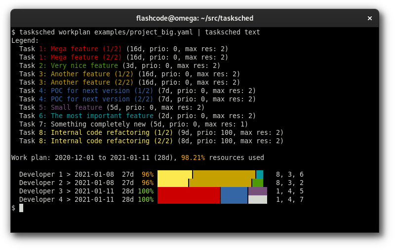

# Task scheduler with automatic resource leveling

[](https://pypi.org/project/tasksched/)
[](https://github.com/tasksched/tasksched/actions?query=workflow%3A%22CI%22)

The task scheduler reads one or more [YAML](https://yaml.org/spec/) or [JSON](https://tools.ietf.org/html/rfc8259)
configuration files, that includes:

- project general information
- list of resources
- list of tasks.

The output is a work plan, with the tasks automatically assigned to resources
("resource leveling"), as YAML format (or JSON).

The goal is to find the best possible end date (as soon as possible).

The internal algorithm follows these rules:

- efficient use of resources, if possible 100%, with no overload at all
- long tasks may be carried out in parallel by several people.

The work plan can be converted to text or HTML (see examples below).

## Dependencies

Taskshed requires Python ≥ 3.7 and:

- [jinja2](https://pypi.org/project/Jinja2/)
- [python-holidays](https://pypi.org/project/holidays/)
- [pyyaml](https://pypi.org/project/PyYAML/)

You can install dependencies in a virtual environment with:

```
pip install -r requirements.txt
```

## Usage

### Input

The input data is written in YAML or JSON format.
One or more files are accepted, each one overwrites any file previously loaded.

The main keys in the input are:

- `project`: project description (object, **required**)
- `resources`: list of resources (list, **required**)
- `tasks`: list of tasks (list, **required**)

The project keys are:

- `name`: the project name (string, **required**)
- `start`: the start date, auto-adjusted to the next business day if needed (for a JSON file, it must be a string with format `YYYY-MM-DD`) (default: today)
- `holidays`: the country ISO code used to skip holidays in work plan (for the list of valid country ISO codes, see: [python-holidays](https://pypi.org/project/holidays/)) (string)

For each resource, the keys are:

- `id`: the resource id (string, **required**)
- `name`: the resource name (string, default: same as `id`)

For each task, the keys are:

- `id`: the task id (string, **required**)
- `title`: the task title (string, default: same as `id`)
- `duration`: the task duration in days, rounded to the next largest integer (if ≤ 0, the task is ignored) (float, **required**)
- `priority`: the task priority: a higher priority uses the task first in the work plan, a negative number makes the task less urgent than the others (integer, default: `0`)
- `max_resources`: the max number of resources to use for this task (integer, default: `2`)

Content of files can be read from standard input or filenames are allowed as
command line arguments. Both can be used at same time.

The command `tasksched` allows three actions:

- `workplan`: build an optimized work plan using project/resources/tasks info
  in input; the output is YAML data (or JSON)
- `text`: convert output of `workplan` action to text for display in the terminal
  (colors and unicode chars are used by default but optional).
- `html`: convert output of `workplan` action to HTML for display in a web browser
  (template and CSS can be customized).

See examples of input files in the [examples](examples/) directory.

## Examples

### Standard input and multiple YAML files

You can pipe content of YAML/JSON files as `tasksched` input.

The following example uses:

- another program called `extract-tasks` to extract tasks from a ticketing tool
- a project configuration file (`project.yaml`)
- a resources configuration file (`team.yaml`)
- an extra-tasks configuration file, these tasks are added to the tasks received
  on standard input (`extra_tasks.yaml`)

So you can build the work plan and convert it to text for display with this command:

```
$ extract-tasks | tasksched workplan project.yaml team.yaml extra_tasks.yaml | tasksched text
```

### Build of work plan

Example of YAML work plan:

```
$ tasksched workplan examples/project_small.yaml
workplan:
  project:
    name: The small project
    start: 2020-12-03
    end: 2020-12-09
    duration: 5
    holidays_iso: FRA
    holidays: []
    resources_use: 70.0
  resources:
  - id: dev1
    name: Developer 1
    assigned:
    - task: '1'
      duration: 5
    assigned_tasks:
    - id: '1'
      title: The first feature
    duration: 5
    end: 2020-12-09
    use: 100.0
  - id: dev2
    name: Developer 2
    assigned:
    - task: '2'
      duration: 2
    assigned_tasks:
    - id: '2'
      title: The second feature
    duration: 2
    end: 2020-12-04
    use: 40.0
  tasks:
  - id: '1'
    title: The first feature
    duration: 5
    priority: 0
    max_resources: 1
  - id: '2'
    title: The second feature
    duration: 2
    priority: 0
    max_resources: 2
```

### Work plan as text

Example of work plan converted to text for display:



### Work plan as HTML

The generated HTML and CSS can be customized.

Tasksched comes with one default template and two default CSS:

- template (using [jinja2](https://pypi.org/project/Jinja2/)):
  - `basic` (source: [basic.html](tasksched/data/html/basic.html))
- CSS:
  - `dark` (used by default, source: [dark.css](tasksched/data/css/dark.css))
  - `light` (source: [light.css](tasksched/data/css/light.css)).

Example of work plan converted to HTML with the default "dark" theme:

```
$ tasksched workplan examples/project_big.yaml | tasksched html > tasksched.html
```

With "light" theme (white background):

```
$ tasksched workplan examples/project_big.yaml | tasksched html --css light > tasksched.html
```

## Copyright

Copyright © 2020-2021 [Sébastien Helleu](https://github.com/flashcode)

This program is free software; you can redistribute it and/or modify
it under the terms of the GNU General Public License as published by
the Free Software Foundation; either version 3 of the License, or
(at your option) any later version.

This program is distributed in the hope that it will be useful,
but WITHOUT ANY WARRANTY; without even the implied warranty of
MERCHANTABILITY or FITNESS FOR A PARTICULAR PURPOSE.  See the
GNU General Public License for more details.

You should have received a copy of the GNU General Public License
along with this program.  If not, see <https://www.gnu.org/licenses/>.
