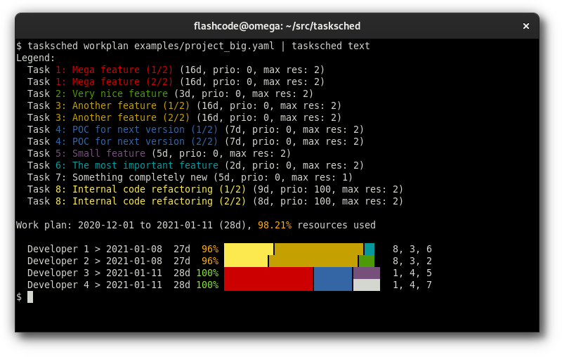

# Task scheduler with automatic resource leveling

[](https://pypi.org/project/tasksched/)
[](https://github.com/tasksched/tasksched/actions?query=workflow%3A%22CI%22)

The task scheduler reads one or more JSON configuration files, that includes:

- project general information
- list of resources
- list of tasks.

The output is a work plan, with the tasks automatically assigned to resources
("resource leveling"), as JSON format.

The goal is to find the best possible end date (as soon as possible).

The internal algorithm follows these rules:

- efficient use of resources, if possible 100%, with no overload at all
- long tasks may be carried out in parallel by several people.

## Dependencies

Taskshed requires Python ≥ 3.7 and:

- [python-holidays](https://pypi.org/project/holidays/)

You can install dependencies in a virtual environment with:

```
pip install -r requirements.txt
```

## Usage

### Input

The input data is written in JSON format.
One or more files are accepted, each one overwrites any file previously loaded.

The main keys in the input are:

Field       | Type   | Required | Default | Description
----------- | ------ | -------- | ------- | -----------
`project`   | object | yes      |         | project description
`resources` | list   | yes      |         | list of resources
`tasks`     | list   | yes      |         | list of tasks

The project keys are:

Field       | Type   | Required | Default | Description
----------- | ------ | -------- | ------- | -----------
`name`      | string | yes      |         | the project name
`start`     | string | -        | today   | the start date (format: `YYYY-MM-DD`), auto-adjusted to the next business day if needed
`holidays`  | string | -        |         | the country ISO code used to skip holidays in work plan (for the list of valid country ISO codes, see: [python-holidays](https://pypi.org/project/holidays/))
`resources` | list   | yes      |         | the list of resources (see below)
`tasks`     | list   | yes      |         | the list of tasks (see below)

For each resource, the keys are:

Field       | Type   | Required | Default      | Description
----------- | ------ | -------- | ------------ | -----------
`id`        | string | yes      |              | the resource id
`name`      | string | -        | same as `id` | the resource name

For each task, the keys are:

Field           | Type    | Required | Default      | Description
--------------- | ------- | -------- | ------------ | -----------
`id`            | string  | yes      |              | the task id
`name`          | string  | -        | same as `id` | the task title
`duration`      | integer | yes      |              | the task duration in days
`priority`      | integer | -        | 0            | the task priority: a higher priority uses the task first in the work plan, a negative number makes the  task less urgent than the others
`max_resources` | integer | -        | 2            | the max number of resources to use for this task

Content of files can be read from standard input or filenames are allowed as
command line arguments. Both can be used at same time.

The command `tasksched` allows two actions:

- `workplan`: build an optimized work plan using project/resources/tasks info
  in input; the output is JSON data
- `text`: convert output of `workplan` action (JSON data) to text for display
  in the terminal (colors and unicode chars are used by default but optional).

## Examples

### Standard input and multiple JSON files

You can pipe content of JSON files as `tasksched` input.

The following example uses:

- another program called `extract-tasks` to extract tasks from a ticketing tool
- a project configuration file (`project.json`)
- a resources configuration file (`team.json`)
- an extra-tasks configuration file, these tasks are added to the tasks received
  on standard input (`extra_tasks.json`)

So you can build the work plan and convert it to text for display with this command:

```
$ extract-tasks | tasksched workplan project.json team.json extra_tasks.json | tasksched text
```

### Build of work plan

Example of JSON work plan:

```
$ tasksched workplan examples/project_small.json | jq
{
  "workplan": {
    "project": {
      "name": "The big project",
      "start": "2020-12-01",
      "end": "2020-12-07",
      "duration": 4,
      "holidays": "FRA",
      "resources_use": 87.5
    },
    "resources": [
      {
        "id": "dev1",
        "name": "Developer 1",
        "assigned": [
          "1",
          "1",
          "1"
        ],
        "assigned_tasks": [
          "1"
        ],
        "duration": 3,
        "end": "2020-12-04",
        "use": 75
      },
      {
        "id": "dev2",
        "name": "Developer 2",
        "assigned": [
          "1",
          "1",
          "2",
          "2"
        ],
        "assigned_tasks": [
          "1",
          "2"
        ],
        "duration": 4,
        "end": "2020-12-07",
        "use": 100
      }
    ],
    "tasks": [
      {
        "id": "1",
        "title": "The first feature (1/2)",
        "duration": 3,
        "max_resources": 2
      },
      {
        "id": "1",
        "title": "The first feature (2/2)",
        "duration": 2,
        "max_resources": 2
      },
      {
        "id": "2",
        "title": "The second feature",
        "duration": 2,
        "max_resources": 2
      }
    ]
  }
}
```

### Work plan as text

Example of work plan converted to text for display:



## Copyright

Copyright © 2020 [Sébastien Helleu](https://github.com/flashcode)

This program is free software; you can redistribute it and/or modify
it under the terms of the GNU General Public License as published by
the Free Software Foundation; either version 3 of the License, or
(at your option) any later version.

This program is distributed in the hope that it will be useful,
but WITHOUT ANY WARRANTY; without even the implied warranty of
MERCHANTABILITY or FITNESS FOR A PARTICULAR PURPOSE.  See the
GNU General Public License for more details.

You should have received a copy of the GNU General Public License
along with this program.  If not, see <https://www.gnu.org/licenses/>.
